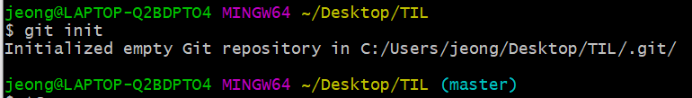

# Git Command

> Git 명령어 정리

## 초기설정

### 0. init

- `git init`
- `.git/` 폴더 생성

- `.git`폴더가 생성된 경우 오른쪽에 `master` 출력 
- 최초의 한번만 하면 됨

### 1. config

- `git config -- global user.email "myemail@gmail.com"`
  - 깃헙에 올릴경우 잔디가 심어지는 기준이므로 깃헙이메일과 동일하게 적어주기
- `git config -- global user.name "myname"`
- 최초에 한번만 하면됨

## 커밋기록

### 1. add

- `git add <추가하고싶은 파일>`
  - `git add .` : 현재 폴더의 모든 파일과 폴더를 add
- working directory => staging area로 파일이동

### 2. commit

- `git commit -m "메세지"`
- 스냅샷 찍는 동작
- add 되어있는 파일들을 하나의 묶음으로 저장
- 메세지에 들어가는 내용은 기능 단위로 적기

### 3. remote 

- `git remote add origin <주소>`
- 원격 저장소와 현재 로컬 저장소 연결

### 4. push

- `git push origin master`
- 깃아 올려줘 origin으로 master를
- 원격저장소에 로컬 저장소의 데이터 전송

## 상태확인

### 1. status

- `git status`
- 현재 git 상태 출력

### 2. log

- `git log`
- 커밋 기록 전체 출력
- 옵션 
  - `oneline` : author, date 같은 정보 제외하고 한줄로 출력
  - `--graph` : 커밋들을 점으로 표현하고 그 커밋을 선으로 연결해서 그래프 형태로 출력

### 3. diff

- `git diff` 
- 현재 변경사항을 체크 (add 하기전에)

## 추가파일

### 1.gitignore

- `gitignore` 파일 생성 후 git으로 관리하고 싶지않은 파일 저장
- [gitigore.io](http://gitignore.io) 

### 2. 이동

- `git switch <브랜치이름>` => 최신문법
- `git checkout <브랜치이름>` => 예전문법

### 3. 삭제

- git branch -D <브랜치이름>

### 4. 병합

- git merge <브랜치이름>
- base(기준)가 되는 branch로 이동해서 명령어 사용 
- 충돌이 발생하는 경우 충돌 해결하고 다시 add, commit, pust