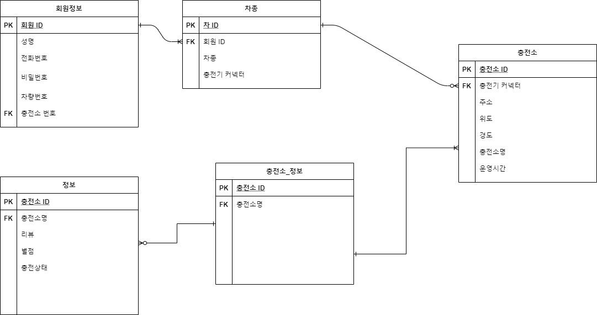

- ### semi_project

- ##### DB설계

  - 요구사항 분석

  - 개념적 모델링 -> ER 다이어그램

  - 논리적 모델링 -> 정규화, SQL

  - 물리적 모델링 -> DB 내부설계, 성능에 대한 고민

  - ER 다이어그램

    

- 이슈
  - 현재 내 위치 파악 -> geolocation api 이용
  - cctv -> 국도 / 고속도로 cctv 존재 
    - 이 데이터로 혼잡도, 대기시간 파악하기 어려움
    - 1차 목표 달성 후 추후에 고민
  - 1개의 회원 ID에 여러 개의 차종이 존재할 경우
    - 2차 정규화 or 차량번호
  - ERD 수정
  - 픽스 데이터와 실시간 데이터 구분하여 테이블 생성
  - 데이터 정보 문서화 할 것!
  - 추가+) 충전기 상태와 종류 테이블 생성